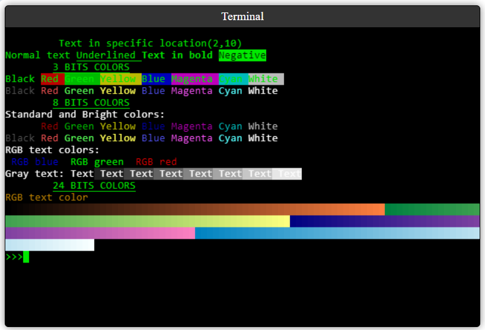

# titoterm.js
Web ANSI Terminal Emulator in Pure Javascript



"titoterm.js" is a lightweight and efficient javascript library for creating terminals or command windows that can work on a Web page.

It implements the main ANSI control sequences that are used in most terminals.

Features: 

- Work on a simple Canvas element.
- It has no external dependencies.
- Implemented in pure Javscript.
- Optimized for quick response.
- Support for color and text attributes.
- Cursor management.
- Reception of pressed keys.

To use it, just include the following files:

```
    <script src="term_ansi.js"></script>    
    <script src="term_emu.js"></script>    
``` 

And create an instance of the TitoTerm element:

```
<script>
    var term = new TitoTerm("id_cnv1");
    term.send("\x1B[0;91m Hello world!\n");    
    term.drawScreen();
</script>
```

To intercept keys received by the terminal, the "txtReceived" event must be implemented:

```
<script>
        var term  = new TitoTerm("id_cnv1", txtReceived);

        function txtReceived(str) {
            //Terminal has received a string (Normally a simple char).
            term.send(str);     //We send back to the terminal.
        }

        term.drawScreen();
</script>
```
